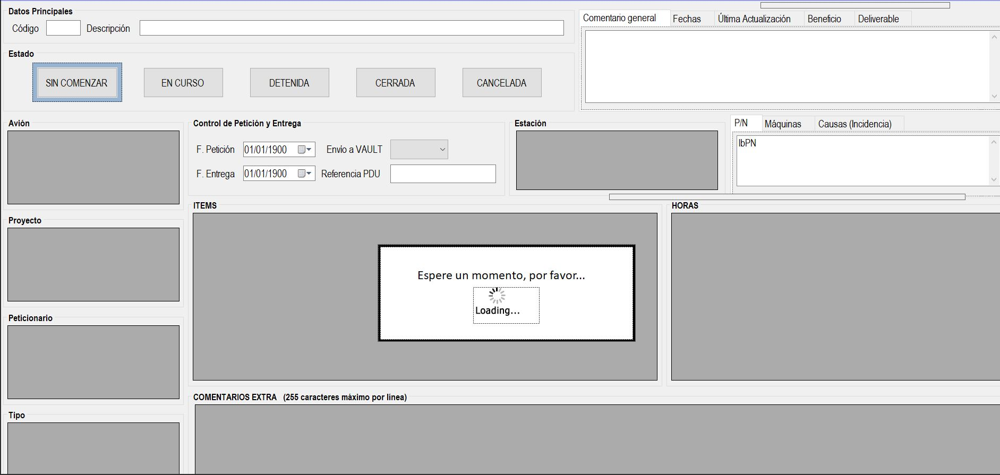

|                   | **Respuestas**                          |
|-------------------|-----------------------------------------|
|**Nombre**         | EditarTarea.vb      |
|**Descripción**    | Ventana que permite ver y editar los detalles de una tarea específica.              |
|**Funcionalidad**  | Puedes cambiar el estado de la tarea o las fechas de petición y entrega. También permite agregar, comentarios, el deliverable, los beneficios o la última actualización de la misma.             |
|**Otros**          | Enseña todos los datos de la tarea.           |
|**Acceso a BD**    | ✅                              |
|*TablaN*           | "Nombre de la tabla a la que se accede" |
|*Consulta*         | ✅ or ❌ |
|*Modificación*     | ✅ or ❌ |
|*Inserción*        | ✅ or ❌ |
|*Borrado*          | ✅ or ❌ |
|**Imagen**           | |