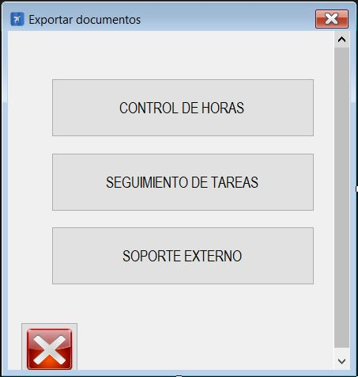

|                   | **Respuestas**                          |
|-------------------|-----------------------------------------|
|**Nombre**         | ExportarDoc.vb      |
|**Descripción**    | Ventana que permite exportar documentos.               |
|**Funcionalidad**  | Permite exportar documentos de control de horas, seguimiento de tareas o soporte externo.             |
|**Otros**          | N/A            |
|**Acceso a BD**    | ✅ or ❌                               |
|*TablaN*           | "Nombre de la tabla a la que se accede" |
|*Consulta*         | ✅ or ❌ |
|*Modificación*     | ✅ or ❌ |
|*Inserción*        | ✅ or ❌ |
|*Borrado*          | ✅ or ❌ |
|**Imagen**           | |