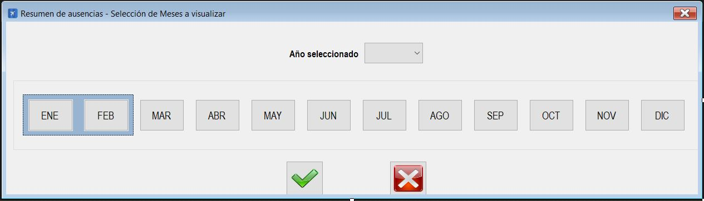

|                   | **Respuestas**                          |
|-------------------|-----------------------------------------|
|**Nombre**         | ControlAusenciasSeleccionMes.vb         |
|**Descripción**    | Ventana que permite seleccionar los meses y el año que se va a mostrar en la ventana ControlAusencias.             |
|**Funcionalidad**  | Selector año: Permite seleccionar el año de los datos que se mostrarán.  Botones meses: Cambia los meses a mostrar.  Botón aceptar: Confirma los cambios de los datos a mostrar y vuelve a la ventana ControlAusencias.  Botón cancelar: Descarta los cambios y vuelve a la ventana ControlAusencias. |
|**Otros**          | N/A         |
|**Acceso a BD**    | ❌                               |
|**Imagen**           | |