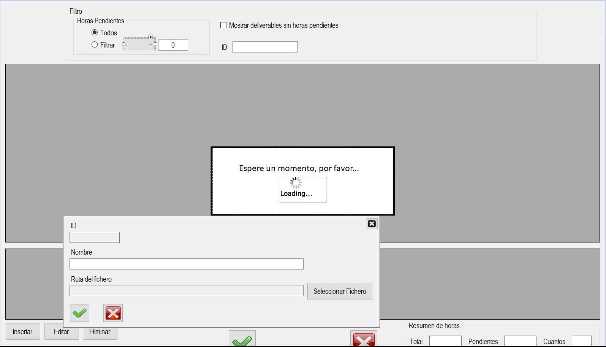

|                   | **Respuestas**                          |
|-------------------|-----------------------------------------|
|**Nombre**         | Deliverables.vb      |
|**Descripción**    | Ventana que muestra los deliverables que tienen y permite añadir o quitar nuevos.              |
|**Funcionalidad**  | Permite visualizar todos los deliverables con un resumen de horas y añadir o quitar algún deliverable.           |
|**Otros**          | Puedes filtrar las horas pendientes y hay una opción para mostrar los deliverables que no tienen horas pendientes.            |
|**Acceso a BD**    | ✅                                |
|*TablaN*           | DocRef |
|*Consulta*         | ✅ |
|*Modificación*     | ✅ |
|*Inserción*        | ✅ |
|*Borrado*          | ✅ |
|**Imagen**           | |