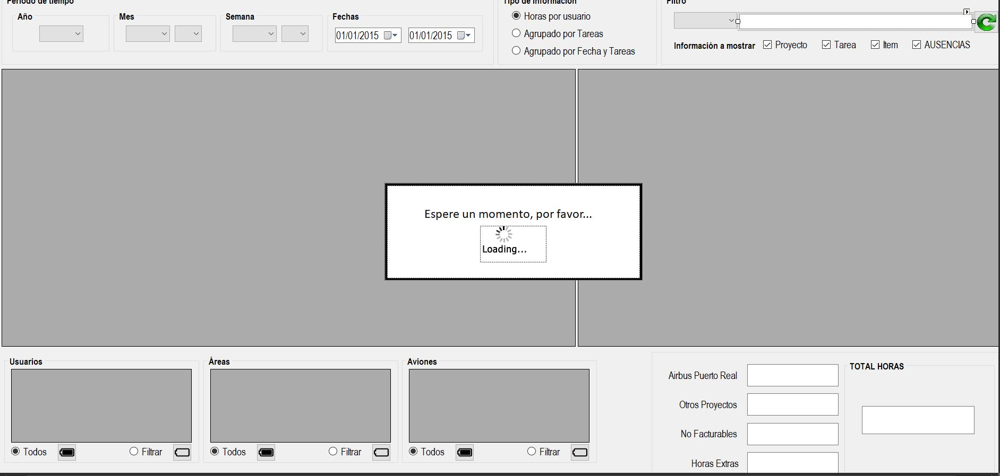

|                   | **Respuestas**                          |
|-------------------|-----------------------------------------|
|**Nombre**         | DetalleHoras.vb     |
|**Descripción**    | Esta ventana permite a los usuarios ver y gestionar el detalle de horas trabajadas, ausencias y otros detalles relacionados con el tiempo de trabajo de los empleados.             |
|**Funcionalidad**  | Permite filtar la información por período de tiempo y tipo de información (Horas por usuario, Agrupado por tareas o Agrupado por fecha y tareas).     |
|**Otros**          | Posee un botón con el cual poder exportarlo a una hoja de cálculo.            |
|**Acceso a BD**    | ✅ |
|*TablaN*           | Usuarios, Areas, Aviones, Calendario |
|*Consulta*         | ✅ |
|*Modificación*     | ❌ |
|*Inserción*        | ❌ |
|*Borrado*          | ❌ |
|**Imagen**           | |