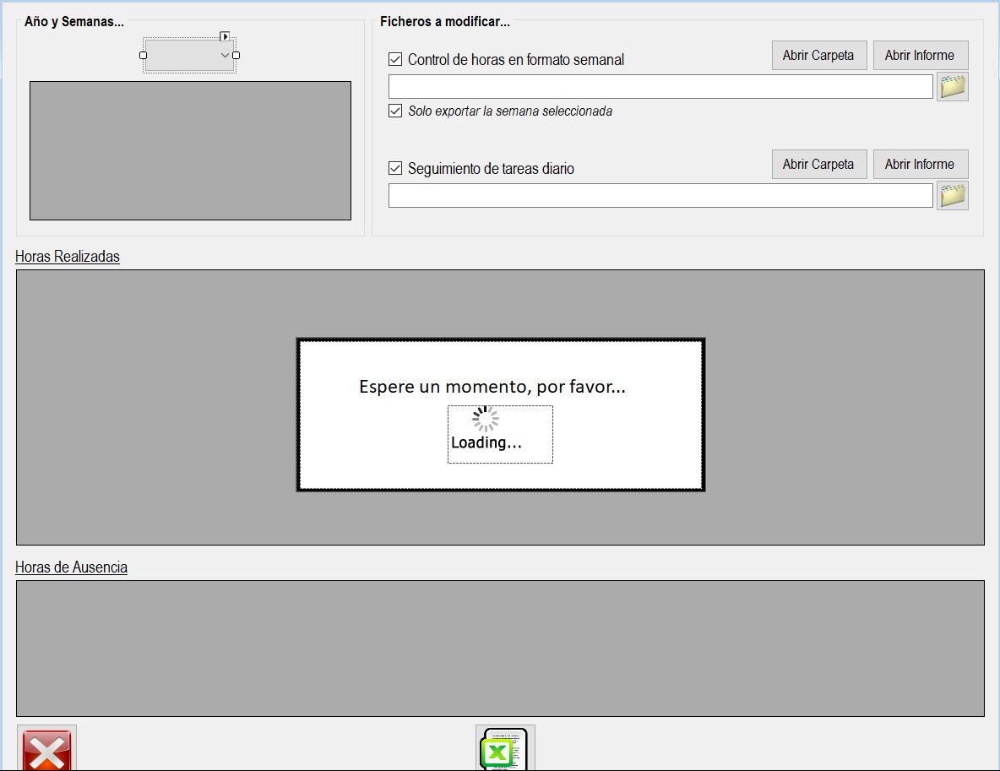

|                   | **Respuestas**                          |
|-------------------|-----------------------------------------|
|**Nombre**         | ExportarControlHoras.vb      |
|**Descripción**    | Esta ventana permite exportar los datos de control de horas y seguimiento de tareas a una hoja de cálculo.              |
|**Funcionalidad**  | Puedes abrir carpetas y archivos para visualizar las horas realizadas y las de ausencia. También permite exportar los datos a una hoja de cálculo.           |
|**Otros**          | Permite ver las horas por semanas del año seleccionado.           |
|**Acceso a BD**    | ✅                              |
|*TablaN*           | Calendario |
|*Consulta*         | ✅ |
|*Modificación*     | ❌ |
|*Inserción*        | ❌ |
|*Borrado*          | ❌ |
|*TablaN*           | Ausencias |
|*Consulta*         | ✅ |
|*Modificación*     | ❌ |
|*Inserción*        | ❌ |
|*Borrado*          | ❌ |
|**Imagen**           | |