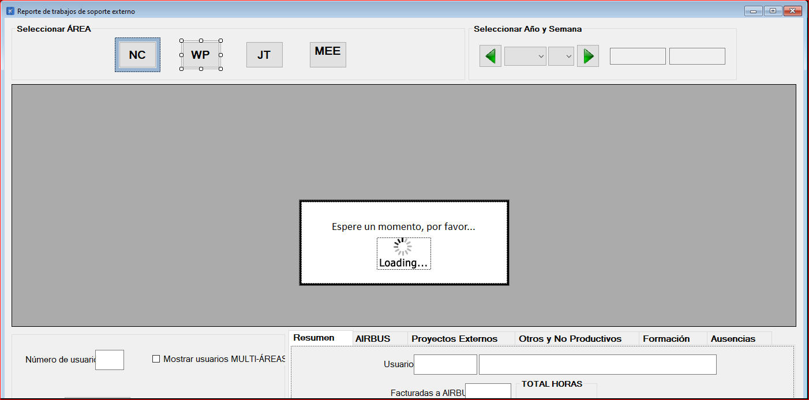

|                   | **Respuestas**                          |
|-------------------|-----------------------------------------|
|**Nombre**         | ExportarSopExterno.vb      |
|**Código**         | `"Código del que se habla"` (Dejar ``)  | 
|**Descripción**    | Reportar el trabajo del soporte externo              |
|**Funcionalidad**  | EstablecerConexion(),EjecutarArea(),AbrirBaseDeDatos(),CerrarBaseDatos(),CargarInfo(),ObtenerParametro(),ObtenerFechaIniSemana(),             |
|**Otros**          | "Otros datos de importancia"            |
|**Acceso a BD**    | ✅                              |
|*TablaN*           | parametros, usuario, area |
|*Consulta*         | ✅  |
|*Modificación*     | ✅  |
|*Inserción*        | ✅  |
|*Borrado*          | ✅  |
|**Imagen**           | |