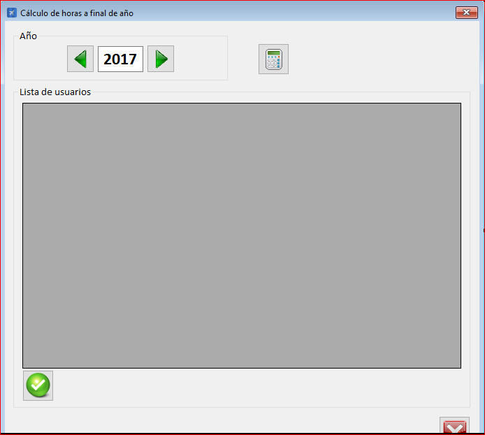

|                   | **Respuestas**                          |
|-------------------|-----------------------------------------|
|**Nombre**         | HoraFinalAnio.vb      |
|**Código**         | `"Código del que se habla"` (Dejar ``)  | 
|**Descripción**    | Calcula las horas que el usuario tiene a final del año y las vacaciones de un año especifico            |
|**Funcionalidad**  | logForm.AbrirBaseDatos(), logForm.CerrarBaseDatos(),logForm.EjecutarSQL(),logForm.CargarUsuariosFinalAnio(),Application.DoEvents(),MessageBox.Show()           |
|**Otros**          | "Otros datos de importancia"            |
|**Acceso a BD**    | ✅                               |
|*TablaN*           | UsuariosHorasFinalAnio |
|*Consulta*         | ✅ |
|*Modificación*     | ❌ |
|*Inserción*        | ❌ |
|*Borrado*          | ❌ |
|**Imagen**           | |

