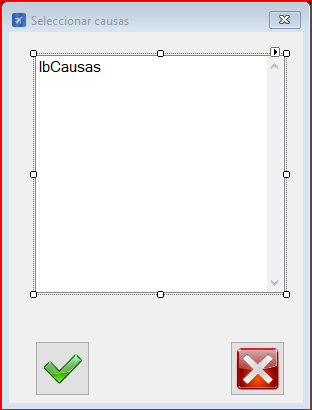

|                   | **Respuestas**                          |
|-------------------|-----------------------------------------|
|**Nombre**         | ListaInsercionCausas.vb      |
|**Código**         | `"Código del que se habla"` (Dejar ``)  | 
|**Descripción**    | El código gestiona un formulario que permite seleccionar causas para asignarlas a una tarea              |
|**Funcionalidad**  | LoadParam(),formularioLlamante(),ListaInsercionCausas_Load(), btnAceptar_Click(),NuevaTarea.lbCausas(),CtMenuListaLimpiar_Click()            |
|**Otros**          | El formulario se cierra al aceptar o cancelar. Los elementos seleccionados se agregan a las listas correspondientes en NuevaTarea o EditarTarea.|
|**Acceso a BD**    | ✅                               |
|*TablaN*           | Causas|
|*Consulta*         | ✅ |
|*Modificación*     | ✅ |
|*Inserción*        | ❌ |
|*Borrado*          | ❌ |
|**Imagen**           | |
