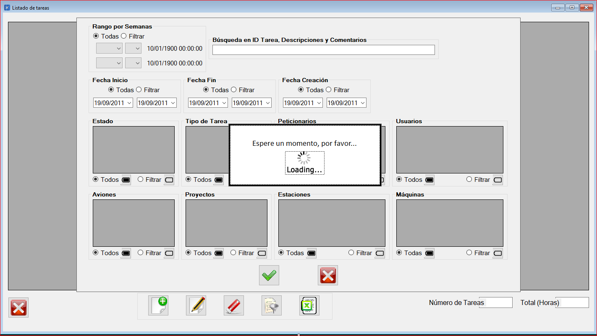

|                   | **Respuestas**                          |
|-------------------|-----------------------------------------|
|**Nombre**         | "CargaInicialVentana.vb"     |
|**Descripción**    | Inicializa y configura la interfaz de usuario para la gestión de tareas, cargando listas de datos desde la base de datos y estableciendo filtros predeterminados.   |
|**Funcionalidad**  | CargarTareas() ConstruirFiltro() logForm.AbrirBaseDatos() logForm.CerrarBaseDatos() logForm.CargarListaDeTareas() logForm.CargarDatosTareaRefrescarLista() logForm.DatosCalAniosTareas() logForm.DatosCalSemanas() logForm.DatosSemana() logForm.DataTiposEstado() logForm.DataPeticionarios() logForm.DataTiposTarea() logForm.DataAviones() logForm.DataProyectos() logForm.DataEstaciones() logForm.DataUsuarios() logForm.DataMaquinas() logForm.CargarPartNumbersTarea() MessageBox.Show()|
|**Otros**          | "Otros datos de importancia"            |
|**Acceso a BD**    | ✅ |
|*TablaN*           |  tareas, estados, usuarios y proyectos |
|*Consulta*         | ✅ |
|*Modificación*     | ✅ |
|*Inserción*        | ❌ |
|*Borrado*          | ❌ |
|**Imagen**           | |
