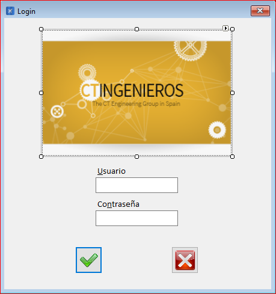

|                   | **Respuestas**                          |
|-------------------|-----------------------------------------|
|**Nombre**         | LogAplicacion.vb      |
|**Código**         | `"Código del que se habla"` (Dejar ``)  | 
|**Descripción**    | Login de la aplicación              |
|**Funcionalidad**  | LogAplicacion_Load(),btnAceptar_Click(),btnCancelar_Click(),LogAplicacion_FormClosed(),TimerInicio_Tick(),logica.ValidarClaveUsuario(),logica.ObtenerRolUsuario(),logica.ObtenerAreaUsuario(),logica.EncriptaSHA(),logica.CargarDatosIni(),logica.EstablecerConexion(),logica.CerrarBaseDatos()        |
|**Otros**          | Opción de cambiar de usuario              |
|**Acceso a BD**    | ✅                               |
|*TablaN*           | Usuarios |
|*Consulta*         | ✅ |
|*Modificación*     | ❌ |
|*Inserción*        | ❌ |
|*Borrado*          | ❌ |
|**Imagen**           | |
