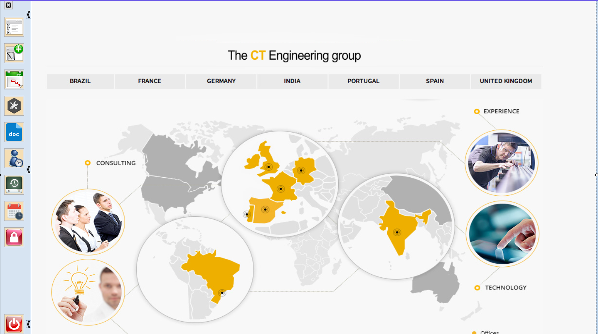

|                   | **Respuestas**                          |
|-------------------|-----------------------------------------|
|**Nombre**         | MDIParent1.vb      |
|**Descripción**    | Ventana principal de la aplicación la cual permite acceder a las diferentes funcionalidades de la misma dependiendo de los permisos que posea el usuario que está accediendo y del botón seleccionado. |
|**Funcionalidad**  | Las funcionalidades de esta ventana son (mediante eventos): AbrirListarTareas(), AbrirNuevaTarea(), AbrirTareasSemana(), AbrirMantenimiento(), AbrirExportarDocs(), AbrirDetalleHoras(), AbrirControlHoras(), AbrirControlAusenciasSeleccionMes(), AbrirProtegerSemanas(), AbrirLogAplicacion(), Ocultar(), Close(), AbrirExportarControlHoras(), AbrirSeguimientoTareas(), AbrirSeguimientoSopExterno(), AbrirCambiarContraseña(), AbrirMtoUsuarios(), AbrirMtoAreas(), AbrirMtoProyectos(), AbrirMtoAviones(), AbrirMtoPeticionarios(), AbrirMtoEstaciones(), AbrirMtoMaquinas(), AbrirMtoTiposTareas(), AbrirMtoTiposAusencias(), AbrirMtoParametros(), AbrirMtoCalendarioLaboral(), AbrirHorasFinalAnio(), ExisteVentanasHijasAbierta(), CerrarVentanasHijasAbiertas(), cambiarFondo(), ActualizarDatosSegunUsuario(), AbrirModoLocal(), LayoutMdi(), ComprobarVentanasParaActivarFondoCTI(), AbrirAcercaDe(), PerformClick(), MostrarPanelBotones()| 
|**Otros**          |    |
|**Acceso a BD**    | ❌ |
|*TablaN*           |    |
|*Consulta*         | ❌ |
|*Modificación*     | ❌ |
|*Inserción*        | ❌ |
|*Borrado*          | ❌ |
|**Imagen**           | _Ventana.png) |