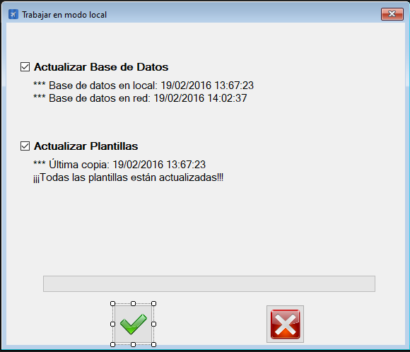

|                   | **Respuestas**                          |
|-------------------|-----------------------------------------|
|**Nombre**         | ModoLocal.vb      |
|**Descripción**    | Ventana que muestra una ventana en la cual se muestra al usuario los datos en local y en la red (junto con sus fechas). También hay dos eventos para aceptar la actualización de la base de datos o cancelarla y salir.|
|**Funcionalidad**  | ExisteVentanasHijasAbiertas(), Close(), GetFiles(), DoEvenets(), Copy(), Exist(), CreateDirectory(), Split(), GetFileInfo(), Count(), cambiarFondo(), CerrarVentanasHijasAbiertas(), Show(), ActualizarDatosSegunUsuario()|
|**Otros**          |     |
|**Acceso a BD**    | ✅ |
|*TablaN*           | "Desconocido" |
|*Consulta*         | ❌ |
|*Modificación*     | ✅ |
|*Inserción*        | ✅ |
|*Borrado*          | ❌ |
|**Imagen**         | |