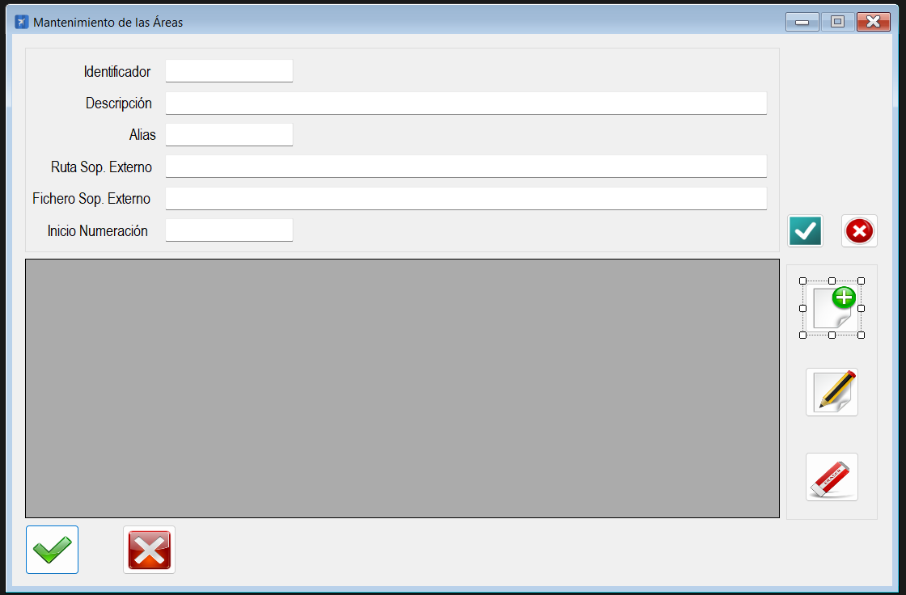

|                   | **Respuestas**                          |
|-------------------|-----------------------------------------|
|**Nombre**         | MtoAreas.vb      |
|**Descripción**    | Ventana que permite la gestion de áreas. Gracias a esto se pueden añadir, eliminar o editar las áreas.             |
|**Funcionalidad**  | Crear área, borrar área, actualizar área            |
|**Otros**          |       -      |
|**Acceso a BD**    | ❌                               |
|*TablaN*           | - |
|*Consulta*         | ❌ |
|*Modificación*     | ❌ |
|*Inserción*        | ❌ |
|*Borrado*          | ❌ |
|**Imagen**           | |