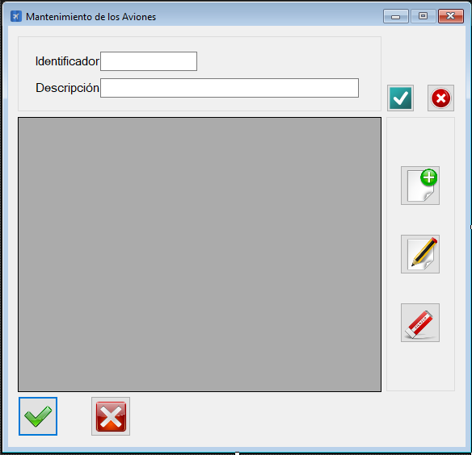

|                   | **Respuestas**                          |
|-------------------|-----------------------------------------|
|**Nombre**         | MtoAviones.vb      |
|**Descripción**    |  Interfáz gráfica que permite la gestión del mantenimiento de los aviones.            |
|**Funcionalidad**  | Permite crear, modificar y/o borrar aviones (pudiendo seleccionar los anteriormente creados)             |
|**Otros**          | -            |
|**Acceso a BD**    | ❌                               |
|*TablaN*           | - |
|*Consulta*         | ❌ |
|*Modificación*     | ❌ |
|*Inserción*        | ❌ |
|*Borrado*          | ❌ |
|**Imagen**           | |