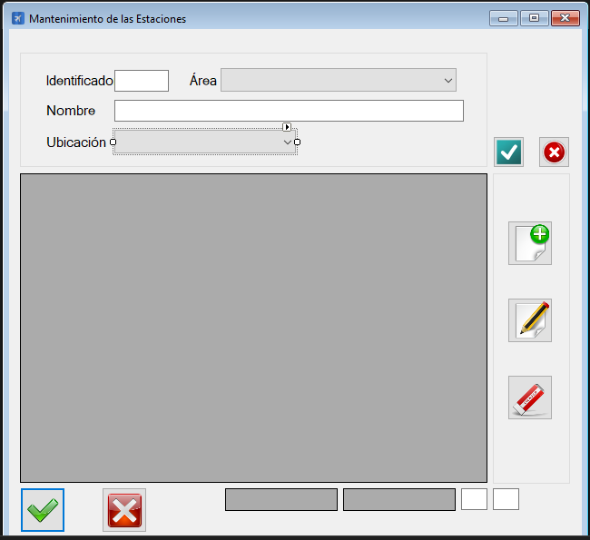

|                   | **Respuestas**                          |
|-------------------|-----------------------------------------|
|**Nombre**         |   MtoEstaciones.vb    |
|**Descripción**    |      Interfáz que gestiona el mantenimiento de las estaciones.         |
|**Funcionalidad**  | Permite la creacción, modificación y borrado de estaciones, así como la asignación del área y ubicación           |
|**Otros**          | -            |
|**Acceso a BD**    | ❌                               |
|*TablaN*           | - |
|*Consulta*         | ❌ |
|*Modificación*     | ❌ |
|*Inserción*        | ❌ |
|*Borrado*          | ❌ |
|**Imagen**           | |