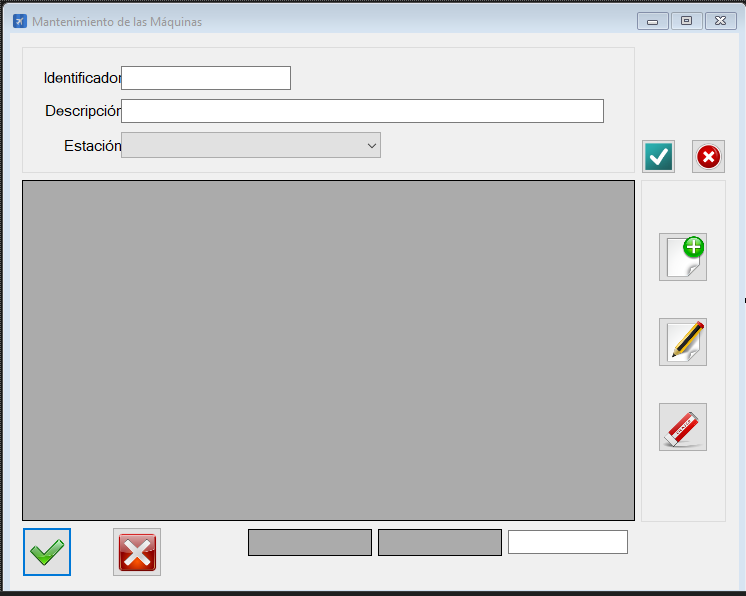

|                   | **Respuestas**                          |
|-------------------|-----------------------------------------|
|**Nombre**         | MtoMaquinas.vb      |
|**Descripción**    | Interfaz que permite la gestión del mantenimiento de las máquinas              |
|**Funcionalidad**  | Asignar, crear, borrar y modificar la tareas.            |
|**Otros**          | -            |
|**Acceso a BD**    | ❌                               |
|*TablaN*           | - |
|*Consulta*         | ❌ |
|*Modificación*     | ❌ |
|*Inserción*        | ❌ |
|*Borrado*          | ❌ |
|**Imagen**           | |