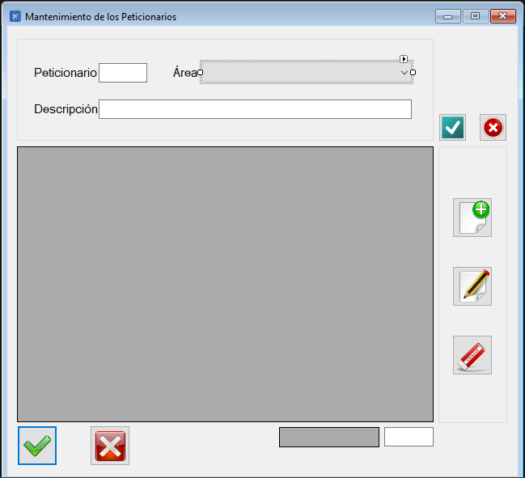

|                   | **Respuestas**                          |
|-------------------|-----------------------------------------|
|**Nombre**         | MtoPeticionarios.vb      |
|**Descripción**    | Interfaz gráfica que permite gestionar los peticionarios.              |
|**Funcionalidad**  | Crear, borrar y modificar peticionario. Asignar peticionario y área del mismo.             |
|**Otros**          | -            |
|**Acceso a BD**    | ❌                               |
|*TablaN*           | - |
|*Consulta*         | ❌ |
|*Modificación*     | ❌ |
|*Inserción*        | ❌ |
|*Borrado*          | ❌ |
|**Imagen**           | |