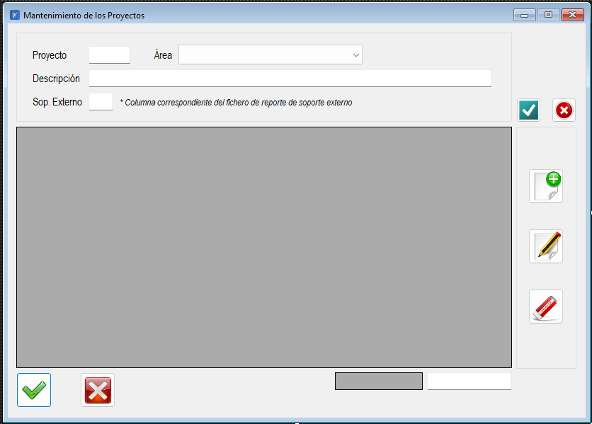

|                   | **Respuestas**                          |
|-------------------|-----------------------------------------|
| **Nombre**        | `MtoProyectos.vb`                      |
| **Descripción**   | Es una clase en un archivo `.vb` que permite gestionar el mantenimiento de proyectos en una aplicación. Permite realizar operaciones CLAB (Crear, Leer, Actualizar, Eliminar) sobre la tabla `Proyectos` de una base de datos. También incluye validaciones de datos y manejo de permisos según el rol del usuario. |
| **Funcionalidad** | - **CRUD de proyectos**: Permite agregar, editar, eliminar y consultar proyectos. - **Validaciones**: Valida campos como ID, área, descripción y soporte externo. - **Manejo de permisos**: Restringe ciertas funcionalidades según el rol del usuario. - **Interfaz gráfica**: Muestra los datos en un `DataGridView` y permite la interacción del usuario mediante controles como `TextBox`, `ComboBox` y botones. |
| **Otros**         | - Utiliza `OleDbDataAdapter` y `DataSet` para interactuar con la base de datos. - Incluye manejo de errores mediante `Try-Catch`. - Organiza el código en regiones para mejorar la legibilidad. |
| **Acceso a BD**   | ✅                                      |
| **TablaN**        | `Proyectos`, `Areas`                   |
| **Consulta**      | ✅                                      |
| **Modificación**  | ✅                                      |
| **Inserción**     | ✅                                      |
| **Borrado**       | ✅                                      |
| **Imagen**        |  |