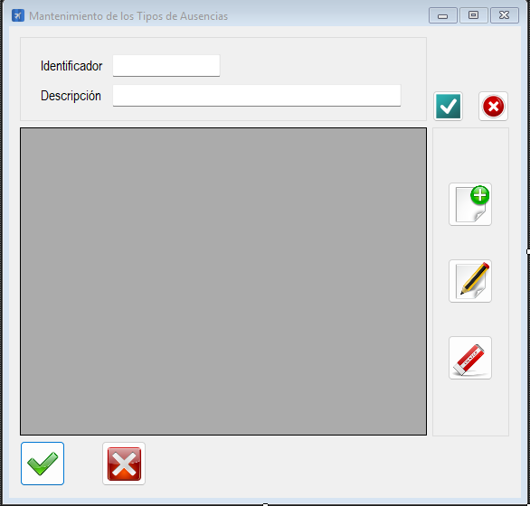

|                   | **Respuestas**                          |
|-------------------|-----------------------------------------|
| **Nombre**        | `MtoTiposAusencias.vb`                 |
| **Descripción**   | Es una clase en un arxhivo `.vb` que permite gestionar el mantenimiento de tipos de ausencias en una aplicación. Permite realizar operaciones CLAB (Crear, Leer, Actualizar, Borrar) sobre la tabla `TipoAusencia` de una base de datos.|
| **Funcionalidad** | - **CRUD de tipos de ausencias**: Permite agregar, editar, eliminar y consultar tipos de ausencias. - **Validaciones**: Valida campos como ID y descripción. - **Manejo de permisos**: Restringe ciertas funcionalidades según el rol del usuario. - **Interfaz gráfica**: Muestra los datos en un `DataGridView` y permite la interacción del usuario mediante controles como `TextBox` y botones. |
| **Otros**         |- Incluye manejo de errores mediante `Try-Catch`. - Organiza el código en regiones para mejorar la legibilidad. |
| **Acceso a BD**   | ✅                                      |
| **TablaN**        | `TipoAusencia`                         |
| **Consulta**      | ✅                                      |
| **Modificación**  | ✅                                      |
| **Inserción**     | ✅                                      |
| **Borrado**       | ✅                                      |
| **Imagen**        |         |