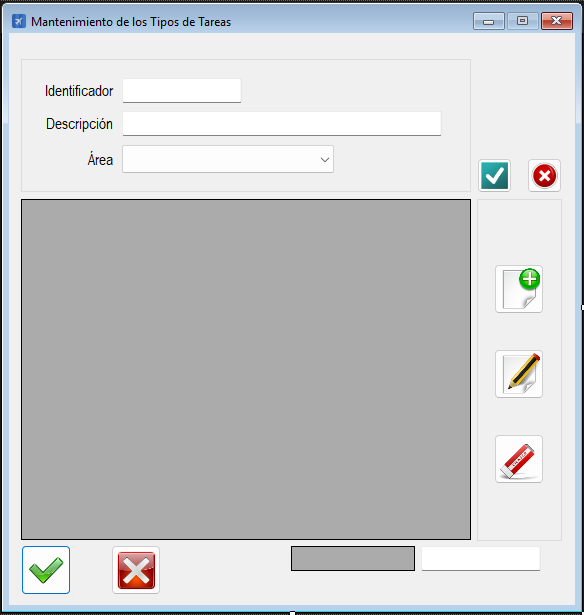

|                   | **Respuestas**                          |
|-------------------|-----------------------------------------|
| **Nombre**        | `MtoTiposTareas.vb`                    |
| **Descripción**   | Es una clase en un archivo `.vb` que permite gestionar el mantenimiento de tipos de tareas en una aplicación. Tmbien Permite realizar operaciones CLAB (Crear, Leer, Actualizar, Borrar) sobre la tabla `TipoTarea` de una base de datos. También incluye validaciones de datos y manejo de permisos según el rol del usuario. |
| **Funcionalidad** | - **CLAB de tipos de tareas**: Permite agregar, editar, eliminar y consultar tipos de tareas. - **Validaciones**: Valida campos como ID, área y descripción. - **Manejo de permisos**: Restringe ciertas funcionalidades según el rol del usuario. |
| **Otros**         | - Utiliza `OleDbDataAdapter` y `DataSet` para interactuar con la base de datos. - Incluye manejo de errores mediante `Try-Catch`. - Organiza el código en regiones para mejorar la legibilidad. |
| **Acceso a BD**   | ✅                                      |
| **TablaN**        | `TipoTarea`, `Areas`                   |
| **Consulta**      | ✅                                      |
| **Modificación**  | ✅                                      |
| **Inserción**     | ✅                                      |
| **Borrado**       | ✅                                      |
| **Imagen**        |         |
---