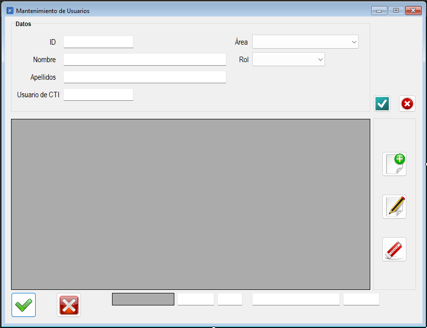

|                   | **Respuestas**                          |
|-------------------|-----------------------------------------|
| **Nombre**        | `MtoUsuarios.vb`                        |
| **Descripción**   | Es una clase en un archivo `.vb` que gestiona el mantenimiento de usuarios en una aplicación. Permite realizar operaciones (Crear, Leer, Actualizar, Borrar) sobre la tabla `Usuarios` de una base de datos. También incluye validaciones de datos, manejo de transacciones y actualización de datos relacionados en otras tablas. |
| **Funcionalidad** | - **CLAB de usuarios**: Permite agregar, editar, eliminar y consultar usuarios. - **Validaciones**: Valida campos como ID, nombre, apellidos, rol y área. - **Transacciones**: Maneja transacciones para asegurar la integridad de los datos. - **Actualización de datos relacionados**: Actualiza tablas relacionadas como `UsuariosAviones`, `UsuariosProyectos` y `UsuariosParametros`.  |
| **Otros**         | - Incluye manejo de errores mediante `Try-Catch`. - Usa encriptación para almacenar contraseñas. - Organiza el código en regiones para mejorar la legibilidad. |
| **Acceso a BD**   | ✅                                      |
| **TablaN**        | `Usuarios`                              |
| **Consulta**      | ✅                                      |
| **Modificación**  | ✅                                      |
| **Inserción**     | ✅                                      |
| **Borrado**       | ✅                                      |
| **Imagen**        |         |
---
