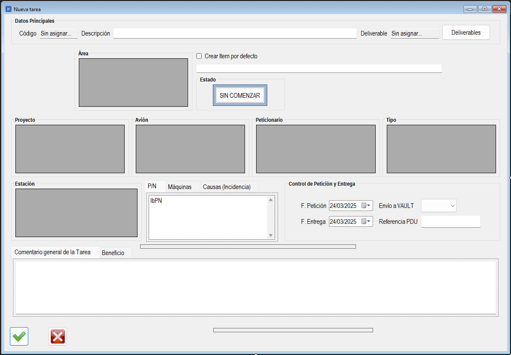

|                   | **Respuestas**                          |
|-------------------|-----------------------------------------|
| **Nombre**        | `NuevaTarea.vb`                         |
| **Descripción**   | Es una clase en un archivo `.vb` que permite crear nuevas tareas en una aplicación de gestión de tareas. Incluye funcionalidades para seleccionar áreas, proyectos, aviones, estaciones, peticionarios, y otros datos relacionados con la tarea. |
| **Funcionalidad** | - **Creación de tareas**: Permite crear nuevas tareas con descripción, horas teóricas, horas de ahorro, y otros detalles. - **Selección de datos**: Permite seleccionar áreas, proyectos, aviones, estaciones, peticionarios, y tipos de tarea. - **Gestión de máquinas y causas**: Permite agregar y eliminar máquinas y causas asociadas a la tarea. - **Gestión de números de parte (PN)**: Permite buscar y agregar números de parte a la tarea. - **Validaciones**: Incluye validaciones para asegurar que los datos ingresados sean correctos.|
| **Otros**         | - Utiliza `OleDbDataAdapter` y `DataSet` para interactuar con la base de datos. - Incluye manejo de errores mediante `Try-Catch`. - Organiza el código en regiones para mejorar la legibilidad. - Permite la selección de múltiples elementos en listas como máquinas y causas. |
| **Acceso a BD**   | ✅                                      |
| **TablaN**        | `Tareas`, `Areas`, `Proyectos`, `Aviones`, `Estaciones`, `Peticionarios`, `Maquinas`, `Causas`, `PartNumbers` |
| **Consulta**      | ✅                                      |
| **Modificación**  | ✅                                      |
| **Inserción**     | ✅                                      |
| **Borrado**       | ❌                                      |
| **Imagen**        |       |
---
