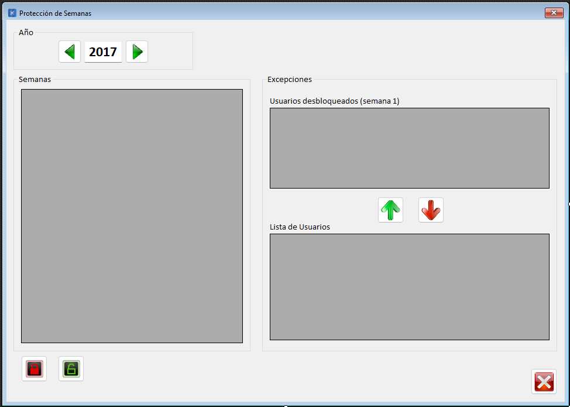

|                   | **Respuestas**                          |
|-------------------|-----------------------------------------|
| **Nombre**        | `ProtegerSemanas.vb`                   |
| **Descripción**   | Es una clase en un archivo `.vb` que permite gestionar el bloqueo y desbloqueo de semanas en el calendario de tareas. Tambien permite agregar y eliminar excepciones para usuarios especificos en semanas bloqueadas. |
| **Funcionalidad** | - **Bloquear/Desbloquear semanas**: Permite bloquear o desbloquear semanas para evitar modificaciones. - **Excepciones de usuarios**: Permite agregar o eliminar usuarios que pueden trabajar en semanas bloqueadas. - **Carga de datos**: Carga las semanas de un año específico y muestra su estado (libre, bloqueada, etc.). |
| **Otros**         | - Utiliza `OleDbDataAdapter` y `DataSet` para interactuar con la base de datos. - Incluye manejo de errores mediante `Try-Catch`. - Organiza el código en regiones para mejorar la legibilidad. - Aplica formato condicional a las celdas del `DataGridView` según el estado de la semana. |
| **Acceso a BD**   | ✅                                      |
| **TablaN**        | `CalendarioSemanas`, `CalendarioExcepciones`, `Usuarios` |
| **Consulta**      | ✅                                      |
| **Modificación**  | ✅                                      |
| **Inserción**     | ✅                                      |
| **Borrado**       | ✅                                      |
| **Imagen**        |         |