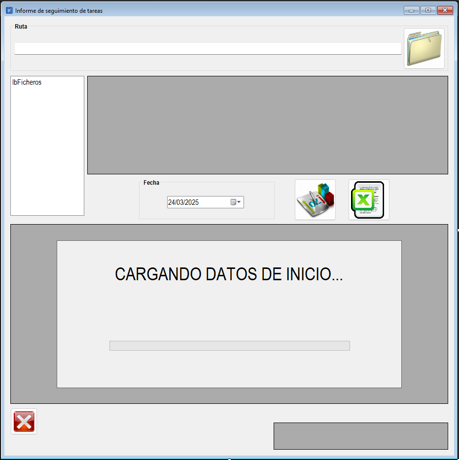

|                   | **Respuestas**                          |
|-------------------|-----------------------------------------|
| **Nombre**        | `SeguimientoTareas.vb`                  |
| **Descripción**   | Es una clase en un archivo `.vb` que gestiona el seguimiento de tareas de los empleados. También permite interactuar con archivos de Excel para crear informes sin errores y tiene funcionalidad para interactuar con la interfaz de usuario. |
| **Funcionalidad** | - `Carga archivos de Excel`: Lee archivos `.xlsx`. - `Procesamiento de datos`: Procesa y valida la información de las tareas. - `Generación de Informes`: Crea informes en Excel basados en los datos procesados. - `Manejo de errores`: Captura y muestra errores durante la ejecución. - `Interfaz gráfica`: Permite al usuario seleccionar directorios, cargar archivos y generar informes mediante botones y controles visuales. |
| **Otros**         | - Utiliza constantes para definir estilos de bordes en Excel. - Manejo robusto de errores mediante `Try-Catch`. - Uso de `DataGridView` para mostrar datos de manera clara. - Organización del código en regiones para mejorar la legibilidad. |
| **Acceso a BD**   | ✅                                      |
| **TablaN**        | `RutaSeguimientoTareas` que no encontre en la imagen de la Base de datos |
| **Consulta**      | ✅                                      |
| **Modificación**  | ❌                                      |
| **Inserción**     | ❌                                      |
| **Borrado**       | ❌                                      |
| **Imagen**        |        |
---
